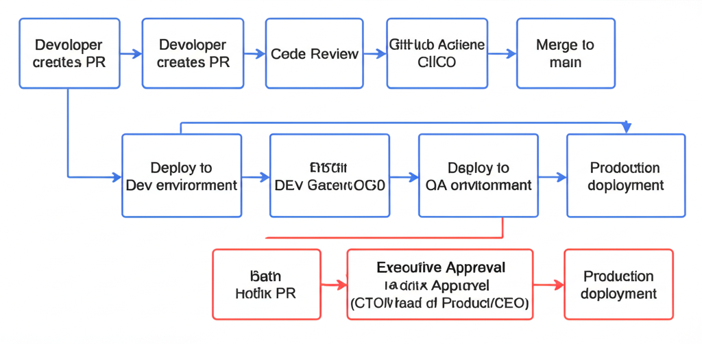

# Deployment & Release Management

**Owner:** Engineering Team
**Version:** 1.1
**Last Reviewed:** 2026-01-29
**Review Cadence:** Quarterly

---

## 1. Purpose

We control deployments to ensure code changes reach production in a predictable, traceable, and reversible manner. This prevents unauthorized or untested changes from affecting customers.

**Risk Reduced:**
- Unreviewed code reaching production
- Production outages from untested changes
- Inability to trace what changed and when

**Stakeholders:**
- Engineering Team (deploy and maintain)
- Product Team (feature delivery)
- Customers (service reliability)

---

## 2. Scope

### In Scope
- **Systems:** All application services deployed via GitHub Actions
- **Environments:** Development, QA, Production
- **Services:** All customer-facing applications, internal tools, APIs
- **Users:** Engineers with repository write access

### Out of Scope
- Infrastructure provisioning (covered by Infrastructure Control)
- Database migrations (covered separately within deployment pipelines)
- Third-party SaaS configurations

---

## 3. Roles & Responsibilities

| Role | Team/Individual | Responsibility |
|------|-----------------|----------------|
| Control Owner | Engineering Lead | Defines deployment standards, ensures compliance |
| Operator | Engineering Team | Executes deployments, monitors releases |
| Reviewer | Peer Engineers | Code review, PR approval |
| Hotfix Approver | CTO / Head of Product / CEO | Approves emergency production hotfixes |

---

## 4. How We Operate This Control

### Deployment Pipeline Overview

*Standard sprint deployments flow through Dev → QA → Production. Hotfixes require executive approval and deploy directly to Production.*

### 4.1 Standard Sprint Deployment

**Trigger:** Sprint completion (typically bi-weekly)

**Steps:**
1. Developer creates PR with changes
2. PR requires approval from:
   - 2 Engineering team members (code review)
   - 1 QA team member (release readiness)
   - 1 Executive: CTO, Head of Product, or CEO (deployment authorization)
3. PR merged to main branch after all approvals
4. GitHub Actions triggers automated pipeline:
   - Build and unit tests
   - Deploy to Dev environment
   - Integration tests
   - Deploy to QA environment
5. QA team validates in QA environment
6. Executive approval gate for production (already obtained in PR)
7. GitHub Actions deploys to Production
8. Post-deployment verification (smoke tests, monitoring)

**Tools:**
- GitHub - Source control, PR reviews
- GitHub Actions - CI/CD pipeline execution
- Teams - Deployment notifications

**Automation:**
- Build, test, and deployment steps are fully automated
- Environment promotion requires manual approval gates

### 4.2 Hotfix Deployment (Production Issues)

**Trigger:** Critical production issue requiring immediate fix

**Difference from standard:** Hotfixes skip the Dev/QA environment progression but still require the same approvals.

**Steps:**
1. Engineer identifies critical issue
2. Engineer creates hotfix branch from production tag
3. Minimal fix implemented and tested locally
4. PR created with `[HOTFIX]` label
5. PR requires approval from:
   - 2 Engineering team members (expedited review)
   - 1 QA team member (may be concurrent with review)
   - 1 Executive: CTO, Head of Product, or CEO
6. Approval documented in PR comments (Slack confirmation acceptable for urgency, screenshot added to PR)
7. PR merged, pipeline deploys directly to Production (skips Dev/QA environments)
8. Hotfix backported to main branch
9. Post-incident review scheduled

**Approval Methods:**
- GitHub PR approval (preferred)
- Slack message confirmation (for urgency - screenshot added to PR)
- [ASSUMPTION: Verbal approval followed by written confirmation within 24 hours]

**Tools:**
- GitHub - Hotfix PR with executive approval
- Slack - Urgent communication and approval trail

**Automation:**
- Pipeline execution is automated
- Approval gate is manual (executive sign-off required)

### 4.3 Monitoring & Verification

**Continuous Monitoring:**
- GitHub Actions pipeline status (real-time)
- Application health checks post-deployment
- Error rate monitoring in production

**Periodic Verification:**
- Weekly: Review deployment frequency and success rate
- Monthly: Audit hotfix deployments and approvals
- Quarterly: Full control review

---

## 5. Operational Guarantees

When this control operates correctly:

- [x] All production deployments pass through automated CI/CD pipeline
- [x] All code changes require 2 engineering reviews + QA approval before production
- [x] All production deployments require executive approval (CTO, Head of Product, or CEO)
- [x] All deployments are logged with timestamp, deployer, and commit hash
- [x] Production deployments can be rolled back within 15 minutes

---

## 6. Evidence Produced

| Evidence Type | Description | System/Tool | Retention | Collection | Owner |
|--------------|-------------|-------------|-----------|------------|-------|
| PR history | Code changes, reviews, approvals | GitHub | Indefinite | Automatic | Engineering |
| Pipeline logs | Build, test, deploy execution | GitHub Actions | 90 days | Automatic | Engineering |
| Deployment records | What deployed, when, by whom | GitHub Actions | 90 days | Automatic | Engineering |
| Hotfix approvals | Executive sign-off for emergency deploys | GitHub/Slack | Indefinite | Manual | Engineering |
| Release notes | Summary of changes per release | GitHub Releases | Indefinite | Manual | Engineering |

### Evidence Retrieval

- **For audits:** GitHub repository > Actions tab > Filter by workflow; PR history shows all reviews
- **For incidents:** GitHub Actions run logs + Git commit history for exact changes

---

## 7. Exceptions & Edge Cases

### Known Exceptions

| Exception | Justification | Compensating Control | Review Date |
|-----------|--------------|---------------------|-------------|
| None currently | - | - | - |

### Exception Process

1. Engineer requests exception via Slack to Engineering Lead
2. Engineering Lead evaluates risk
3. If production impact, escalate to CTO for approval
4. Exception documented in deployment PR
5. Exceptions reviewed quarterly

### Edge Cases

- **Executive unavailable for hotfix approval:** Contact executives in order (CTO → Head of Product → CEO). If none available within 30 minutes for critical issue, Engineering Lead may approve with immediate notification to all three.
- **Pipeline failure during deployment:** Automatic rollback triggered. Manual intervention required to diagnose and retry.
- **Security vulnerability hotfix:** Follows hotfix process with additional security team notification.

---

## 8. Review & Maintenance

**Review Schedule:**
- **Frequency:** Quarterly
- **Next Review:** 2025-04-27
- **Reviewer:** Engineering Lead

**Update Triggers:**
- Changes to CI/CD tooling
- New environment additions
- Security incidents related to deployments
- Changes in approval authority

**Change History:**

| Date | Change | Author |
|------|--------|--------|
| 2025-01-27 | Initial document creation | Engineering Team |

---

## 9. Related Controls

| Control Area | Relationship |
|-------------|--------------|
| Access Control & Identity Management | Governs who can merge and deploy |
| Logging & Monitoring | Captures deployment events and application health |
| Incident Response | Activated when deployments cause outages; hotfix process defined there |
| Vulnerability Management | Scan results can block deployments |
| Secure Development & Data Protection | Code quality gates enforced before deployment |
| System Component Inventory | Tracks what gets deployed; dependency versions |
| Security Standards & Exception Governance | Deployment process exceptions follow governance process |
